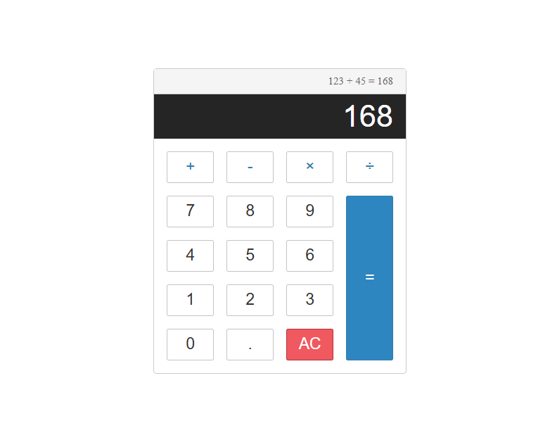
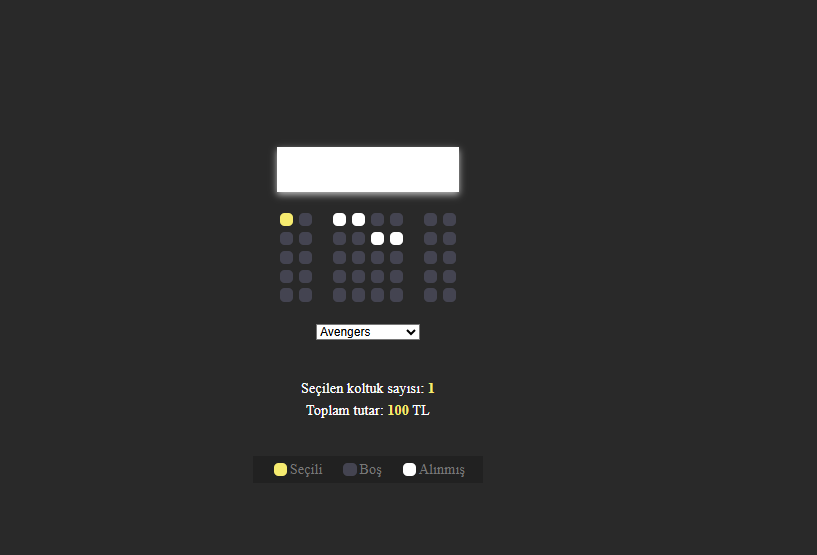
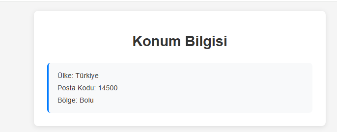
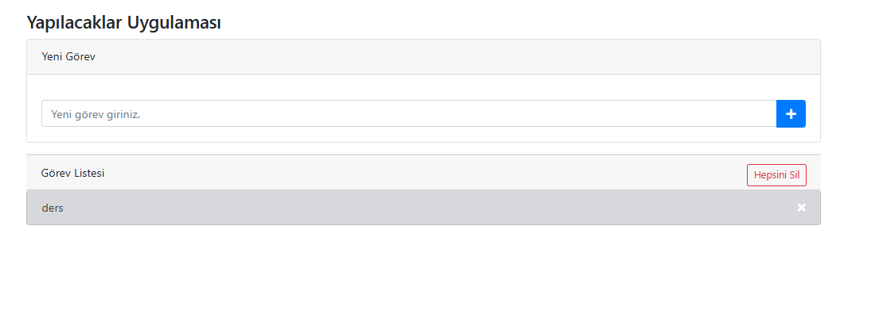

# JavaScript Projeler Koleksiyonu - Kapsamlı Web Uygulamaları Derlemesi

## Genel Bakış

Bu depo, çeşitli programlama kavramlarını, kullanıcı arayüzü tasarımlarını ve JavaScript işlevselliklerini sergileyen kapsamlı bir interaktif JavaScript web uygulamaları koleksiyonu içerir. Her proje, DOM manipülasyonu, olay yönetimi, yerel depolama, coğrafi konum API'leri ve duyarlı tasarım gibi ön uç geliştirmenin farklı yönlerini göstermektedir.

## Özellikler

- **İnteraktif Web Uygulamaları**: 6 tam işlevsel JavaScript projesi
- **Duyarlı Tasarım**: CSS Grid ve Flexbox kullanarak mobil uyumlu arayüzler
- **Modern JavaScript**: ES6+ özellikleri ve en iyi uygulamalar
- **Yerel Depolama Entegrasyonu**: Tarayıcı oturumları boyunca veri kalıcılığı
- **API Entegrasyonu**: Coğrafi konum ve haritalama hizmetleri
- **Kullanıcı Deneyimi**: Düzgün animasyonlar ve geçişlerle sezgisel arayüzler

---

## **Proje Yapısı**

```
/javascript-projects
│── README.md                 # Proje dokümantasyonu
│── /calculator               # Gelişmiş hesap makinesi uygulaması
│   │── index.html           # Hesap makinesi arayüzü
│   │── script.js            # Hesaplama mantığı ve olay işleyicileri
│   │── style.css            # Hesap makinesi stilleri ve animasyonları
│── /cinema_reservation       # Sinema salonu koltuk rezervasyon sistemi
│   │── index.html           # Sinema oturma arayüzü
│   │── script.js            # Koltuk seçimi ve rezervasyon mantığı
│   │── style.css            # Sinema düzeni ve koltuk stilleri
│── /google_location          # Coğrafi konum ve haritalama uygulaması
│   │── index.html           # Konum görüntüleme arayüzü
│   │── script.js            # Coğrafi konum API entegrasyonu
│   │── style.css            # Harita ve konum stilleri
│── /hangman                  # Klasik kelime tahmin oyunu
│   │── index.html           # SVG grafikleri ile oyun arayüzü
│   │── script.js            # Oyun mantığı ve kelime yönetimi
│   │── style.css            # Oyun stilleri ve animasyonları
│── /quiz_app                 # İnteraktif quiz uygulaması
│   │── index.html           # Quiz arayüzü
│   │── app.js               # Quiz mantığı ve puanlama sistemi
│   │── style.css            # Quiz stilleri ve ilerleme göstergeleri
│── /todo                     # Görev yönetimi uygulaması
│   │── index.html           # Todo listesi arayüzü
│   │── script.js            # Görev CRUD işlemleri
│   │── style.css            # Todo listesi stilleri
```

---

## **Projeler Detayları**

### 🧮 **Hesap Makinesi** (`/calculator`)

Gelişmiş web tabanlı hesap makinesi uygulaması:

**Özellikler:**

- Temel aritmetik işlemler (+, -, ×, ÷)
- Hesaplama geçmişi görüntüleme
- Klavye ve fare desteği
- Türkçe arayüz
- Hata kontrolü ve validasyon

**Kullanılan Teknolojiler:** Vanilla JavaScript, CSS Grid, Event Delegation

**Ekran Görüntüsü:**



---

### 🎬 **Sinema Rezervasyon Sistemi** (`/cinema_reservation`)

Sinema salonu koltuk rezervasyon uygulaması:

**Özellikler:**

- İnteraktif koltuk haritası ve görsel geri bildirim
- Koltuk durumları: Müsait, seçili ve dolu
- Gerçek zamanlı toplam fiyat hesaplaması
- Yerel depolama ile rezervasyon verileri kaydetme
- Film seçimi ve fiyat kategorileri

**Kullanılan Teknolojiler:** JavaScript DOM Manipülasyonu, CSS Flexbox, Local Storage

**Ekran Görüntüsü:**



---

### 📍 **Google Konum** (`/google_location`)

Coğrafi konum tabanlı haritalama uygulaması:

**Özellikler:**

- Kullanıcının mevcut coğrafi konumunu alma
- İnteraktif harita üzerinde konum görüntüleme
- Detaylı konum bilgileri gösterme
- Harita üzerinde işaretleme ve zoom özelliği
- Konum paylaşımı ve kaydetme

**Kullanılan Teknolojiler:** HTML5 Geolocation API, Google Maps Entegrasyonu, JSON veri işleme

**Ekran Görüntüsü:**



---

### 🎯 **Adam Asmaca Oyunu** (`/hangman`)

Klasik kelime tahmin oyunu:

**Özellikler:**

- SVG tabanlı adam asmaca çizimi
- Türkçe kelime veritabanı
- Harf tahmin etme ve görsel geri bildirim
- Kazanma/kaybetme durumu yönetimi
- Oyun skorları ve istatistikleri
- Animasyonlu geçişler

**Kullanılan Teknolojiler:** SVG Grafikleri, Oyun Mantığı Algoritmaları, CSS Animasyonları

**Ekran Görüntüsü:**


---

### 📝 **Quiz Uygulaması** (`/quiz_app`)

İnteraktif çoktan seçmeli quiz platformu:

**Özellikler:**

- Dinamik çoktan seçmeli sorular
- Görsel ilerleme çubuğu ve soru sayacı
- Gerçek zamanlı puanlama sistemi
- Detaylı quiz sonuçları ve geri bildirim
- Kategori bazlı sorular
- Zaman sınırı ve zorluk seviyeleri

**Kullanılan Teknolojiler:** Constructor Functions, Bootstrap Entegrasyonu, JSON Veri Yönetimi

**Ekran Görüntüsü:**


---

### ✅ **Todo Uygulaması** (`/todo`)

Kapsamlı görev yönetim sistemi:

**Özellikler:**

- Görev ekleme, düzenleme, silme ve tamamlama
- Yerel depolama ile kalıcı görev saklama
- Filtreleme seçenekleri: Tümü, aktif, tamamlanan
- Bootstrap ile profesyonel ve duyarlı arayüz
- Drag & drop ile görev sıralama
- Görev kategorileri ve öncelik seviyeleri

**Kullanılan Teknolojiler:** Local Storage API, Bootstrap Framework, Drag & Drop API

**Ekran Görüntüsü:**



---

## **Kurulum ve Çalıştırma**

### **1. Depoyu Klonlayın**

```bash
git clone https://github.com/kullaniciadiniz/javascript-projects.git
cd javascript-projects
```

### **2. Projeleri Çalıştırın**

Her proje bağımsızdır ve ayrı ayrı çalıştırılabilir:

```bash
# Herhangi bir projeyi tarayıcınızda açın
# Örneğin, hesap makinesini çalıştırmak için:
start calculator/index.html

# Veya yerel sunucu kullanın (önerilen)
# Python kullanarak
python -m http.server 8000

# Node.js kullanarak (http-server yüklüyse)
npx http-server

# VS Code Live Server eklentisi kullanarak
# index.html dosyasına sağ tıklayın -> "Open with Live Server"
```

### **3. Proje Erişimi**

- Her proje için `http://localhost:8000/[proje-adi]/` adresine gidin
- Veya `index.html` dosyasını doğrudan tarayıcınızda açın

---

## **Kullanılan Teknolojiler**

### **Frontend Teknolojileri**

- **HTML5**: Semantik işaretleme ve modern web standartları
- **CSS3**: Flexbox, Grid, animasyonlar ve duyarlı tasarım
- **JavaScript (ES6+)**: Modern JavaScript özellikleri ve en iyi uygulamalar

### **API'ler ve Kütüphaneler**

- **Geolocation API**: Konum tabanlı hizmetler
- **Local Storage API**: İstemci tarafı veri kalıcılığı
- **Bootstrap**: Seçili projeler için responsive framework
- **Google Maps API**: Harita entegrasyonu

### **Grafik ve Animasyon**

- **SVG**: İnteraktif grafikler ve animasyonlar
- **CSS Animations**: Düzgün geçişler ve efektler

---

## **Öğrenme Kavramları**

Bu projeler aşağıdaki temel web geliştirme kavramlarını kapsar:

- **DOM Manipülasyonu**: Dinamik içerik güncellemeleri ve olay yönetimi
- **Olay Odaklı Programlama**: Kullanıcı etkileşimi ve responsive arayüzler
- **Yerel Depolama**: İstemci tarafı veri kalıcılığı
- **API Entegrasyonu**: Tarayıcı ve harici API'larla çalışma
- **Nesne Yönelimli Programlama**: Constructor functions ve prototipler
- **Duyarlı Tasarım**: Mobil öncelikli ve uyarlanabilir düzenler
- **Oyun Geliştirme**: Mantık uygulaması ve durum yönetimi
- **Kullanıcı Deneyimi**: Sezgisel arayüzler ve etkileşim tasarımı

---

## **Tarayıcı Uyumluluğu**

- ✅ Chrome (önerilen)
- ✅ Firefox
- ✅ Safari
- ✅ Edge
- ⚠️ Internet Explorer (sınırlı destek)

---

## **Katkıda Bulunma**

Katkılarınızı memnuniyetle karşılıyoruz! Lütfen bir Pull Request göndermekten çekinmeyin. Büyük değişiklikler için, önce ne değiştirmek istediğinizi tartışmak için bir issue açın.

### **Katkı Süreci:**

1. Bu depoyu fork edin
2. Özellik dalınızı oluşturun (`git checkout -b yeni-ozellik`)
3. Değişikliklerinizi commit edin (`git commit -am 'Yeni özellik ekle'`)
4. Dalınızı push edin (`git push origin yeni-ozellik`)
5. Pull Request oluşturun

---

## **Lisans**

Bu proje açık kaynaklıdır ve MIT Lisansı altında kullanılabilir.

---

## **Geliştirici**

**Hakan Çetinkaya** - Full Stack JavaScript Geliştirici

- **Odak Alanları**: İnteraktif web uygulamaları ve kullanıcı deneyimi tasarımı
- **Teknolojiler**: JavaScript, HTML5, CSS3, modern web API'leri
- **İletişim**: [GitHub Profili](https://github.com/kullaniciadiniz)

---

## **Proje Durum ve Güncellemeler**

- 🔄 **Son Güncelleme**: Temmuz 2025
- 📊 **Toplam Proje**: 6 Adet
- 🎯 **Durum**: Aktif Geliştirme
- 📝 **Gelecek Planlar**:
  - React.js ile gelişmiş projeler
  - Node.js backend entegrasyonu
  - Progressive Web App (PWA) özellikleri
  - TypeScript dönüşümü

---

## **Teşekkürler**

Bu projelerin geliştirilmesinde ilham veren açık kaynak topluluğuna ve JavaScript ekosistemindeki tüm geliştiricilere teşekkür ederim.

---

_Son Güncelleme: Temmuz 2025_
